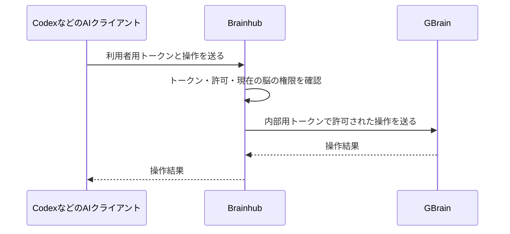

# Brainhubの「鍵」とアクセス許可をゼロから理解する

「鍵」は、プログラムがサーバーへアクセスするときに提示する長い文字列です。
正式にはトークンと呼びます。Brainhubでは、文字列を受け取ったサーバーが、その鍵に対応する利用者・許可・有効期限を調べます。

## まず、3種類の確認がある

| 確認 | 答えること | 例 |
|---|---|---|
| 認証 | あなたは誰か | Brainhubにログインする |
| 脳の権限 | あなたは何ができるか | 自分の脳は編集可能、他人の公開脳は閲覧可能 |
| AIへの認可 | 自分にできることを、どこまでAIに任せるか | Codexには読み取りだけを許可する |

自分が編集できても、AIに編集を任せるとは限りません。逆に、AIに読み書きを許可しても、自分に編集権限がない脳を編集できるようにはなりません。

## 鍵は、どこで使われるのか



AIが持つのはBrainhub用の鍵です。GBrain用の鍵はBrainhubサーバーが持ち、AIには渡しません。
なお、通常はAIモデル自身が秘密の文字列を扱うのではなく、Codexなどのクライアントが通信時に付けます。

この分担により、Brainhubが利用者の権限を確認してからGBrainへ進めます。ブラウザの編集機能を削除しても、この確認は必要です。

## ログインして「許可する」を押すと何が起きるのか

1. Codexが「この接続を認可してほしい」とブラウザを開きます。
2. 利用者がBrainhubにログインします。パスワードをCodexに教える必要はありません。
3. 「読み取り・書き込み」か「読み取りのみ」を選びます。
4. Brainhubは一度だけ使える認可コードをCodexへ返します。
5. CodexがそのコードをBrainhubに渡し、アクセス用と更新用のトークンを受け取ります。

このように、パスワードを別のアプリに渡さず、許可した範囲のアクセスを任せる仕組みをOAuthと呼びます。

認可コードだけを横取りされても交換できないよう、Codexは接続開始時に作った秘密の値も示します。これがPKCEです。Brainhubはその値が、接続開始時の約束と一致するかを確認します。

## 似た名前の文字列を区別する

| 名前 | 役割 | 秘密か |
|---|---|---|
| MCP URL | 接続先の住所 | 通常は公開できる |
| Client ID | どの登録済み接続からの要求かを示す識別子 | 単体では秘密ではない |
| 認可コード | 許可後、トークンを受け取るための引換券 | 秘密。一度限りで短命 |
| アクセストークン | ページを読む・保存する要求に付ける鍵 | 秘密 |
| リフレッシュトークン | 新しいアクセストークンを受け取る鍵 | 秘密 |
| 内部client secret | BrainhubがGBrain用トークンを取得するための秘密 | サーバー内だけに保持 |

Client IDだけを知っていても、ページを読んだり編集したりはできません。
アクセストークンは、持っている相手が利用できる種類の鍵です。そのため通信をHTTPSで保護し、ログや会話に貼り付けないようにします。

Brainhubは利用者用トークンの原文ではなく、そのハッシュをDBに保存します。ハッシュは照合用の値です。一方、GBrainの内部client secretは再利用する必要があるため、暗号化して保存します。

## 読み取りと書き込みの違い

読み取りでは、利用者が見られる複数の脳をまとめて検索します。書き込みでは、どの脳に保存するかを一つ指定します。

| 対象 | 利用者の権限 | AIへの許可 | AIができること |
|---|---|---|---|
| 自分の脳 | オーナー | 読み書き | 読む・ページを作成／更新する |
| 自分の脳 | オーナー | 読み取りのみ | 読む |
| チームの脳 | 編集者 | 読み書き | 読む・ページを作成／更新する |
| 他人の公開脳 | 閲覧のみ | 読み書き | 読む |

読み書きで必ず別々の鍵が必要、という一般ルールがあるわけではありません。
現在のBrainhubでは、GBrainの「複数Sourceの読み取り許可」と「一つのSourceに固定した書き込み許可」を使っています。そのため、読むときには利用者別reader、書くときには対象脳のwriterへ切り替えます。利用者から見れば接続は一つです。

Brainhubが画面で「脳」と呼んでいる保存先は、この構成ではGBrain内のSourceに対応します。

## 書き込みを許可すると、何でも変更できるのか

できません。この実装で許可するのは、現在編集権限がある利用可能な脳への、`put_page` によるページの作成・更新です。
Sourceの作成・削除などの管理機能は公開しません。

`put_page` はページ全体を置き換える操作です。AIは編集前に全文を読み、必要な既存内容を保持してから保存します。GBrain側に更新前バージョンの一致を必須にする機能はないため、同じページへの同時編集を自動的に競合解決する仕組みではありません。

## 有効期限と失効

この実装の認可コードは5分、アクセストークンは1時間、リフレッシュトークンは発行から30日有効です。
更新時には新しいリフレッシュトークンを発行し、使った古いものは再利用できなくします。通常はクライアントが更新するので、毎時間ログインする必要はありません。

有効期限と利用権限は別です。鍵がまだ有効でも、利用者が脳の編集権限を失ったら、その後の書き込み要求は拒否されます。
接続のトークンを失効させた場合も、そのトークンを使った以後の要求は通りません。

既存の読み取り専用トークンは、アプリを更新しても読み取り専用のままです。
書き込みを追加する場合は再認可が必要です。Codexでは次を実行し、ブラウザで許可して新しい会話を開きます。

```sh
codex mcp login brainhub --scopes read,write
```

新しく読み取りのみのトークンを発行することと、過去の書き込み可能なトークンを失効させることも別です。既存のアクセス自体を止めたい場合には失効操作を使います。
