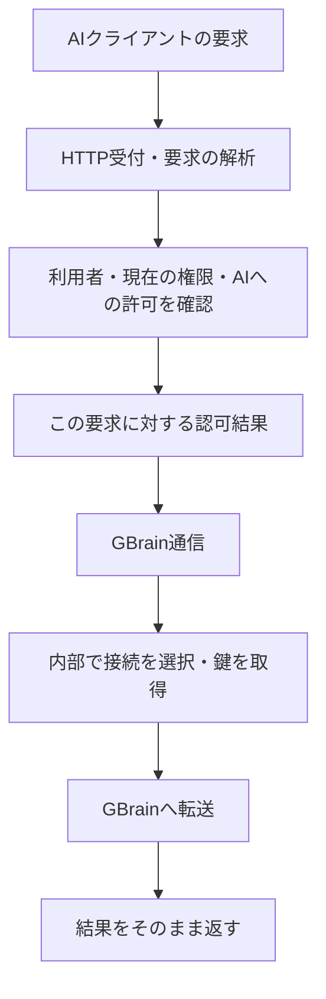

# 読み書きの処理からGBrainの鍵管理を切り離す計画

状態: 計画のみ。実装開始は別途。基準コミット: `96d5f7d`。

## 目指す状態

ページを保存する処理を読めば、「利用者を確認する → 保存を許可するか判断する → GBrainへ保存を依頼する」と理解できるようにする。
GBrain用Clientの選択、秘密情報の復号、トークン取得・更新、HTTPヘッダーへの設定を、その流れの中で扱わない。

対象は既存実装の責務整理。GBrainのClient登録やSource分離を廃止する計画ではない。
利用者向けのBrainhub OAuthと、BrainhubからGBrainへ接続する内部認証は区別する。前者の許可・トークン管理はAI接続機能に必要なので残す。

## 現在、どこから詳細が漏れているか

| 箇所 | 現在の責務 | 変更後 |
|---|---|---|
| `api/usecase/interactor/mcp.go` の `AuthorizeCall` | 利用者と権限を確認し、GBrainの鍵も取得する | 当該リクエストの認可結果だけを返す |
| `api/usecase/input_port/mcp.go` の `MCPCallAuthorization` | `GBrainToken` と `StripSource` を持つ | 利用者・許可対象・操作の情報を持つ。内部の鍵を含めない |
| `api/api/handler/mcp.go` | HTTP解析、認可、GBrain用引数変換、鍵の差し替え | HTTP解析、認可、認可済みリクエストの引き渡し |
| `api/adapter/gbrain/proxy.go` | ほぼ素通しのHTTP転送 | 認可済みリクエストをGBrainへ送るための変換と接続準備も担当する |
| `SourceAccess` / `UserReadAccess` | 上位に内部トークンを返す | 上位には接続準備・復旧などの操作だけを公開する |
| `brain.go` の `createRecords` | 脳・所有者と一緒に接続の準備中レコードを組み立てる | 業務として「脳と所有者を初期登録する」と読める窓口へまとめる |

Webのページ閲覧はすでに `PageReader.List/Get` の中で接続を取得しており、参考になる。新しいWeb保存APIは作らない。

## 責任の分け方



### アプリ側に残す判断

- Brainhub用トークンの照合、期限、失効、利用者の有効性。
- 現在のMembershipと公開状態に基づく閲覧範囲。
- `put_page` の書き込み許可、明示的な保存先、現在のowner/editor権限、ready状態。
- 接続の復旧を誰が依頼できるか。

GBrain通信側がMembershipを独自に読み直して別の権限ルールを持つ形にはしない。

### GBrain通信側にまとめる処理

- 利用者別の読み取り接続、Source専用の書き込み接続の選択。
- 読み取り範囲の更新と、変更後の古いトークンの破棄。
- 秘密情報の復号、トークン取得・キャッシュ・更新。
- GBrainへ渡すAuthorizationの差し替え。
- 許可済みの検索・取得への `source_id` 設定と、`put_page` 転送時の `source_id` 除去。
- 許可された保存先に応じた `tools/list` の書き込みツール追加。
- 接続準備失敗時の転送停止。権限の広い接続への代替は行わない。

既存の `httputil.ReverseProxy`、`SourceAccessService`、`UserReadAccessService` を使う。汎用Gatewayフレームワークや新しい依存ライブラリは追加しない。

## 認可結果の契約

通信側へ渡すのは、次のような秘密情報を含まない値にする。型名の変更を目的にはしない。

- 利用者ID。
- この要求で許可された読み取りSource一覧。
- 明示的に指定され、検証を通過した取得先、または許可範囲全体を対象にする指定。
- 保存の場合だけ、対象のBrain IDとSource ID。
- ツール一覧用の、書き込み可能なSource一覧。
- 検証対象になったMCP操作との対応。

これは一回の要求の内部データであり、新しいトークンやDBレコードではない。リクエストごとに作り、次の要求へ使い回さない。
`tools/list` に表示される書き込み可能なSource一覧と、実際の一回の書き込み許可を混同しない。

受け渡しは、既存のサーバー内部contextによる受け渡しを拡張する方針とする。解析済み要求と認可結果を対応させ、handlerとproxyで別々の要求を認識する状態を作らない。
クライアントが送ったHTTPヘッダーから認可結果を復元しない。認可結果が欠落・不整合の場合には転送しない。
書き込み先だけを付ければ任意のMCPツールがwriterで動く、という実装にはしない。書き込み対象と `put_page` の対応も通信境界で検証する。

HTTP handlerは、mainで注入された通信処理へ渡す。handlerからGBrain adapterを直接生成しない。`net/http` の型を業務usecaseへ持ち込まない。

## 移行手順

### 1. 外部から見た動作を固定する

既存のOAuth/MCP結合テスト、Source分離、SSE転送、接続再発行のテストを基準にする。
足りない「認可済みの読み取りでも、範囲更新失敗なら503で転送されない」ケースを、実際のhandlerとproxyを通るテストで補う。

単体テストの内部呼び出し先が変わっても、HTTP結果、GBrainへ送る内容、拒否される範囲を弱めない。

### 2. 通常のMCP要求から内部トークンを取り除く

`AuthorizeCall` を認可専用にし、`MCPCallAuthorization.GBrainToken` を削除する。
GBrain通信側で接続準備、トークン取得、ヘッダー差し替えを行う。handlerで行っているGBrain固有の引数変換とツール一覧用情報も、同じ通信境界へまとめる。

この段階で「認可は成功したが接続できない」は通信側の失敗になる。現行と同じHTTP 503を返し、上流呼び出しを0回にする。
認可失敗の401／MCP tool errorと、通信準備失敗の503を混ぜない。応答開始後のSSEエラーを別のJSON応答で上書きしない。

この変更は、認可結果・handler・proxy・配線を一組のコミットにする。中途半端に旧形式と新形式を混在させない。

### 3. 接続管理の窓口を狭くする

読み書きが新しい経路で動くことを確認してから、上位のinterfaceからGBrain内部トークンを返す操作を外す。
起動時照合のためだけにトークンを取得して捨てている箇所は、「現在の閲覧範囲で接続を準備する」という操作へ置き換え、内部で同じ更新処理を実行する。

`Connection` が画面に渡すのは接続状態と復旧理由だけにし、内部の暗号化秘密情報を含む `ReaderClient` 全体を上位に返さない。既存のJSON形式は維持する。
状態表示・再発行・起動時照合で、Clientの選択や暗号化方式を上位に露出させない。

### 4. 脳の初期登録から資格情報の保存手順を隠す

`createRecords` の3レコード作成を「脳と所有者の初期登録」という永続化操作にまとめる。
Brainとowner Membershipはusecaseで作成し、内部接続の準備中レコードは永続化の実装側で組み立てる。
脳・所有者・接続準備レコードが同じDBトランザクションで保存されることを維持する。

GBrainの接続発行はトランザクションの外に保ち、発行失敗時のdegraded状態、起動時再開、明示的な再発行を維持する。
`BrainWriterClientRepository` の6操作は、ここで通常のusecaseから参照されなくなる。保存・復旧に必要な操作として通信／永続化の内部に残し、単なる名前置換で済ませない。

招待受諾にもMembership作成があるため、共有操作を一括削除しない。旧client発行APIの整理は別件とし、今回の境界変更に紛れて削除しない。

### 5. 配線・説明・回帰確認

未使用になった窓口だけ削除し、`main.go` とアーキテクチャ説明を最終形へ合わせる。
管理画面の認証、ページ閲覧、脳作成、接続復旧、MCP読み書きを確認する。
各段階を独立したコミットにし、実装完了時にpushする。

## 守る契約と確認方法

| 契約 | 確認 |
|---|---|
| 既存の読み取り専用tokenは昇格しない | 同意・交換・refreshの既存テスト |
| owner/editorでもAIへの書き込み許可がなければ保存不可 | 実際のhandler→proxyを通る書き込みテスト |
| reader/public/他人の非公開Sourceへの保存不可 | 上流への書き込みが0回であること |
| メンバー降格・退出・公開範囲の変更が次の要求に反映される | 同じtokenで権限変更前後を比較 |
| 認可情報が欠けた要求や、別操作への使い回しでwriterを取得できない | proxy境界の拒否テスト |
| readerの範囲更新失敗、writer取得失敗で503になる | 上流への転送が0回であること |
| 普通の読み取りやSource管理操作へwriterを渡さない | 上流が受け取ったAuthorizationを確認 |
| JSON-RPC IDと本文を保持し、保存先を間違えない | 大きな数値ID、改行を含むMarkdown、明示的Sourceで比較 |
| SSEが応答完了までバッファされない | 既存の先頭イベント到着テスト。catalogはJSON/SSE両方を確認 |
| 接続を毎回発行し直さない | 既存clientの再利用、再発行時だけ旧client失効・キャッシュ更新 |
| 脳初期登録の途中失敗でレコードが半端に残らない | 使い捨てPostgreSQLでトランザクションと復旧を確認 |
| Webの閲覧と接続設定が維持される | 既存ブラウザ回帰テスト |

実装時の必須確認:

```sh
go -C api test ./...
go -C api test -race ./...
go -C api vet ./...
npm --prefix web run check
npm --prefix web test
npm --prefix web run build
```

加えて、使い捨てDBのrepository結合テストと、Playwright環境で `npm --prefix web run test:browser` を実行する。
実際のGBrainとの保存契約を再確認する必要が生じた場合は、隔離されたテスト環境を使う。利用者の既存ページで保存実験をしない。

## 今回変更しないもの

- 外部URL、OAuthの要求・許可範囲、tokenの期限と失効の仕様。
- DBスキーマ、既存の資格情報、暗号化キー、GBrain上のClient名。
- MCPの公開ツールとページ全体置換の仕様。
- Web編集の再導入、AIからのSource作成、GBrain更新、Google連携。
- 読み取りと書き込みの接続を全権限の共通接続へまとめること。

マイグレーションや資格情報の一斉再発行を必要としない移行にする。
ローカル反映前に動作中のアプリイメージを残し、問題が出た場合はアプリ側だけを戻せるようにする。

## 完了条件

1. 通常の保存・検索・取得のusecaseとHTTP handlerに、GBrain内部トークンの取得・返却・差し替えがない。
2. 認可結果は当該要求の利用者と許可対象を示し、秘密情報を含まない。
3. GBrain用の接続選択・引数変換・鍵取得・転送失敗時の停止が通信の内部にまとまっている。
4. 接続の準備中・失敗・復旧の保存手順を、ページ処理や脳初期登録のusecaseが組み立てない。
5. 現行の成功・拒否・復旧・ストリーミング動作のテストが通る。

今回の計画作成では、アプリコードの編集、再起動、資格情報の変更、データの書き込みは行わない。
